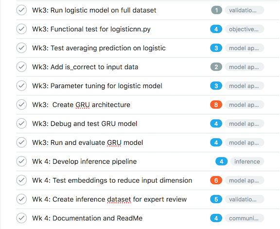

# Student Lesson PathFinder
[*Insight AI Fellowship Project*] The purpose of this project is to auto-generate lessons for students using Khan Academy. Every week, millions of students access Khan Academy for its free educational content. However, because there are thousands of different exercises, videos and articles, students can easily lose track of their progress. The goal of this project is to try to learn optimal content pathways from highly motivated students. The model uses Gate Recurrent Unit (GRU) model, a type of RNN, to predict optimal future session activities.


### How It Works
The goal of the model is to learn how highly-motivated students progress through Khan Academy, and use that information to curate lessons for future students navigating the site.

The model uses a type of Recurrent Neural Network (RNN) called Gated Recurrent Unit (GRU) to learn the representation of student pathways. Because RNN models are able to hold memory over many prediction steps, they are often used to predict sequences, such as words in a sentence or levels in a game. The _PathFinder_ customizes the GRU model to student learning sequences.


#### GRU Model
I selected the GRU model, because it can transfer memory from previous input steps to future steps with mechanisms to avoid [vanishing gradients](https://en.wikipedia.org/wiki/Vanishing_gradient_problem). Below is a diagram representing how the GRU model works at each step. At time step _t_, input _x<sub>t</sub>_ and a hidden layer _h<sub>t-1</sub>_ are fed into the model. The hidden layer represents the memory passed in from previous steps. The update gate _z<sub>t</sub>_ is then used to decide what to keep and what to throw out.

*from Chris Colah's blog*

The _PathFinder_ adapted the GRU model to predict lessons on Khan Academy for individual students. Below is a diagram of how the _PathFinder_ predicts activities for one student session. Each session is represented as a vector or embedding describing all the activities they worked on and what percent of questions they answered correctly. At each time step, the GRU model reads the vector representing the last session, along with a hidden layer representing the stored memory of previous sessions. The model generates an output and a new hidden layer based on on what it wants to throw out and keep. By having the flexibility to store different components of previous activities in memory, the GRU model generates much better prediction than using just the information from the last session.


For each predicted session, the model validates the recommendation against actual activities completed by students. Since the model is trained and validated on highly-motivated students, the assumption is that if a model is able to predict their selected activities with high recall and precision, it is picking the optimal pathway. Because there are thousands of possible activities selected and individual student pathways can be quite varied, the precision and recall will not be comparable to applications in language prediction.


### Data Description

The model is trained on anonymized Khan Academy student sessions from March to June 2018. This data is not publicly avaialble, but a dummy play dataset is available in this repo.

Input: The model expects a series of __input tokens__ representing activities for each session and a __token index__ that will the translate the tokens to readable activity names.

For example, Nadia might have 3 sessions that looks like the following:

```
    Session 1: equivalent fractions (50%), recognizing fractions (75%)
    Session 2: equivalent fractions (100%), recognizing fractions (100%)
    Session 3: equivalent fractions (95%), recognizing fractions (100%), cutting shapes into parts (75%)
```

And the activities map to the following tokens in the __token index__:

```
    { recognizing fractions: 1, equivalent fractions: 2, cutting shapes into parts: 4}
```

Based on the index and the session activities, the __input tokens__ for Nadia will look like this:

```
    {'Nadia': {'Session 1': [(2, 0.5), (1, 1.0)],
               'Session 2': [(2, 1.0), (1, 1.0)],
               'Session 3': [(2, 0.95), (1, 1.0), (3, 0.75)]}
```


### What are the files in this repo

`input`: Directory with files storing model parameters

> `my_env.yml`: Stores conda environment

> `model_params.yaml`: Stores model parameters for `train.py`

> `predict_params.yaml`: Stores prediction parameters for `predict.py`


`model`: Directory that runs the GRU model on tokenized data

> `train.py`: Run training model and evaluate the test result

> `gru.py`: Define the GRU model class, with forward propagation and loss function

> `evaluate.py`: Functions to evaluate loss

> `process_data.py`: Functions to convert ingested token data into model input vector

> `predict.py`: Run inference on test data using a trained model

> `logisticnn.py`: Run a logistic model prediction, not used for GRU model but provides baseline performance

`data`: Directory to process raw data into tokenize form, with available index

`summary`: Summarize dataset and perform kmeans-cluster on raw student data


### How to run model and inference

#### Set-up
1. Clone repo into your local machine:  
    `git clone git@github.com:catli/student_lesson_autogeneration.git`

2. Create a conda environment with the appropriate specifications to run file:  
    `conda env create -f environment.yml`

3. Test that you can perform training with the dummy datasest. In the project directory, run test:  
    `python model/unit_test.py`


#### Training
Here are steps to train a model:  
1. Input the related parameters in `model_params.yaml`, including the dataset name, exercise file and content index file  

2. In the project directory, run training:  
    `python model/train.py`


#### Testing
Here are steps to generate predictions on a test dataset:
1. Input the related parameters in `predict_params.yaml`, including the dataset name, content index file, and the model. You can pick a pre-trained model from `output/...`

2. In the project directory, run the following:
    `python model/predict.py`


### Results
Below are the comparison results:


### Resources
The model is inspired by a couple of different resources, available here:

[RNN for game generation](https://medium.com/@ageitgey/machine-learning-is-fun-part-2-a26a10b68df3)  
[Deep Knowledge Tracing](https://web.stanford.edu/~cpiech/bio/papers/deepKnowledgeTracing.pdf)  
[Paper on GRU Model](https://arxiv.org/pdf/1406.1078.pdf)  
[Colah's Blog on RNN](http://colah.github.io/posts/2015-08-Understanding-LSTMs/)


### Workstream
This project was completed over 4 weeks. Below is the snapshot of the steps and tasks to build the model.

  


